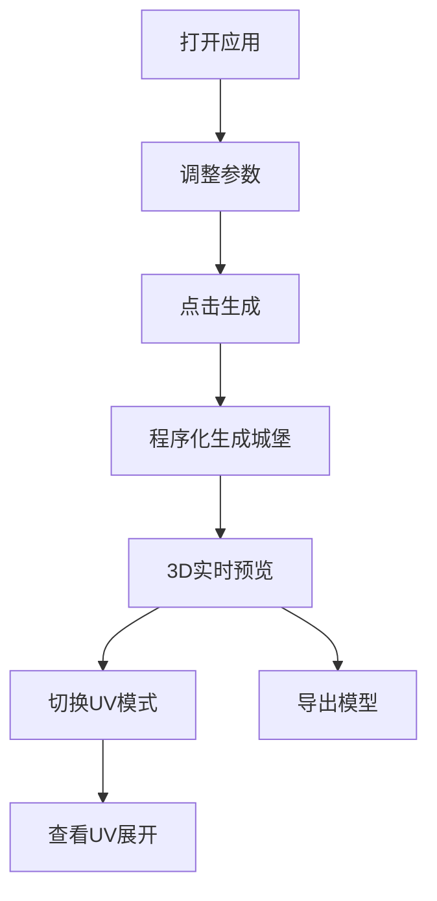

## 1. 产品概述

程序化中世纪城堡生成工具是一款基于Web的3D建模应用，用户可通过调整参数自动生成风格各异的中世纪城堡模型，支持实时预览和UV展开导出。

- 面向游戏开发者、3D艺术家和历史爱好者
- 解决手工建模城堡耗时费力的问题，快速生成多样化城堡原型
- 提供参数化控制，支持导出带UV的模型用于后续制作

## 2. 核心功能

### 2.1 用户角色
| 角色 | 注册方式 | 核心权限 |
|------|----------|----------|
| 普通用户 | 无需注册 | 使用全部生成功能，在线预览 |

### 2.2 功能模块
1. **主界面**：3D视口、参数控制面板、顶部工具栏
2. **城堡生成器**：城墙、塔楼、城门、护城河、内部建筑
3. **UV展开系统**：自动展平UV、UV预览、纹理导出
4. **材质系统**：多种材质预设、纹理参数调节

### 2.3 页面详情
| 页面名称 | 模块名称 | 功能描述 |
|---------|---------|----------|
| 主界面 | 3D视口 | 实时渲染城堡模型，支持轨道缩放旋转 |
| 主界面 | 参数面板 | 调节地块大小、城墙高度、塔楼数量等参数 |
| 主界面 | 顶部工具栏 | 生成/重置/导出/UV模式切换 |
| 主界面 | UV预览 | 切换显示UV展开结果 |

## 3. 核心流程

用户打开应用 → 调整各项参数 → 点击生成按钮 → 实时预览城堡模型 → 切换UV模式查看展开效果 → 导出模型或截图

## 4. 用户界面设计

### 4.1 设计风格
- 主色调：深灰石墙色（#2a2a2a）搭配古铜金（#b8860b）点缀
- 按钮风格：石材质感，轻微凸起，点击凹陷效果
- 字体：Cinzel（标题，中世纪风格） + Lato（正文）
- 布局风格：左侧参数面板，中央3D视口，顶部工具栏
- 整体氛围：复古中世纪手稿风格，羊皮纸背景纹理

### 4.2 页面设计概述
| 页面名称 | 模块名称 | UI元素 |
|---------|---------|--------|
| 主界面 | 3D视口 | 暗黑背景、柔和环境光、雾效、地面网格 |
| 主界面 | 参数面板 | 分组折叠面板、滑块、数字输入、下拉选择 |
| 主界面 | 顶部工具栏 | 图标按钮、分隔线、生成按钮高亮 |
| 主界面 | UV预览 | 棋盘格纹理、UV线框显示 |

### 4.3 响应式
- 桌面端优先，左侧固定参数面板，中央3D视口
- 平板端参数面板可折叠
- 移动端参数面板移至底部抽屉

### 4.4 3D场景指引
- 环境：柔和的半球光 + 方向光模拟日光，营造温暖的午后氛围
- 光照：主光源45度角投射，配合环境光补光，阴影柔和
- 相机：初始45度俯视角，支持OrbitControls轨道控制
- 构图：城堡居中，周围留有适当空间，地面有阴影接收
- 交互：鼠标拖拽旋转、滚轮缩放、右键平移
- 后处理：轻微泛光、色调映射、环境雾
- 性能：控制面数在合理范围，支持LOD切换
