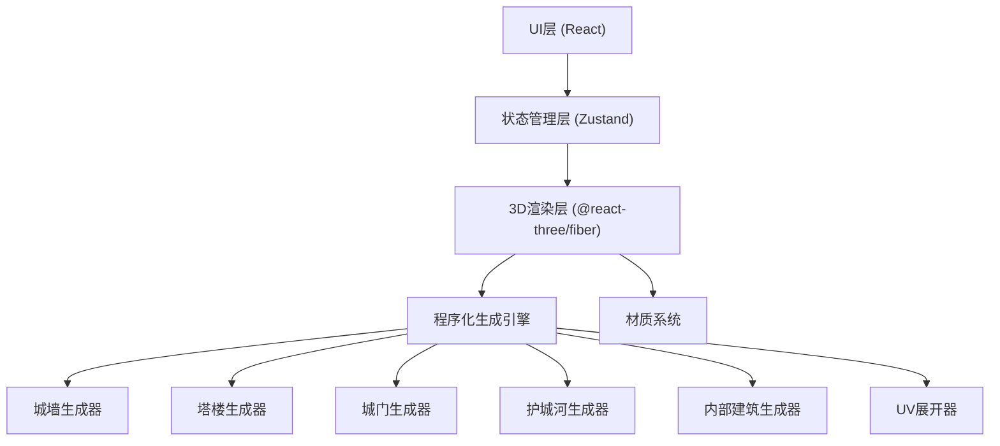

## 1. 架构设计



## 2. 技术描述
- 前端框架：React@18 + TypeScript
- 构建工具：Vite@5
- 样式方案：TailwindCSS@3
- 3D引擎：three@0.160 + @react-three/fiber@8 + @react-three/drei@9
- 状态管理：zustand@4
- 后处理：@react-three/postprocessing@2
- UI组件：自定义组件 + lucide-react图标

## 3. 路由定义
| 路由 | 用途 |
|-----|------|
| / | 主界面，城堡生成器 |

## 4. 数据模型

### 4.1 城堡参数模型
```typescript
interface CastleParams {
  plotWidth: number;
  plotDepth: number;
  wallHeight: number;
  wallThickness: number;
  towerCount: number;
  towerHeight: number;
  towerRadius: number;
  hasMoat: boolean;
  moatWidth: number;
  moatDepth: number;
  gateWidth: number;
  gateHeight: number;
  buildingCount: number;
  buildingHeight: number;
  seed: number;
}
```

### 4.2 生成结果模型
```typescript
interface CastleModel {
  walls: Mesh[];
  towers: Mesh[];
  gate: Mesh;
  moat: Mesh;
  buildings: Mesh[];
  ground: Mesh;
  uvs: UVMap;
}
```

## 5. 核心模块说明

### 5.1 程序化生成引擎
- 基于种子的伪随机数生成，确保结果可复现
- 城墙沿地块轮廓生成，支持多边形轮廓
- 塔楼均匀分布在城墙转角和线段中点
- 护城河沿城墙外围生成
- 内部建筑在院落内随机分布，避免重叠

### 5.2 UV展开器
- 按面组自动分割UV壳
- 平面投影方式展平每个部件
- 自动排列UV岛，最大化利用纹理空间
- 支持棋盘格预览验证UV质量

### 5.3 材质系统
- 石材墙面材质：法线贴图、粗糙度贴图
- 木质城门材质：木纹纹理
- 水面材质：折射、反射、波动动画
- 屋顶材质：瓦片纹理

## 6. 性能优化
- 几何体合并，减少draw call
- 共享材质实例
- 视锥体剔除
- 合理的阴影距离限制
- 纹理压缩与Mipmap
